# ESP32-TOOLS-PRO-480x320-V2.0

Multi-tool firmware for ESP32 Dev Module with a 480x320 SPI TFT display. This V2.0 version adds real support for external IR and CC1101 modules, new WiFi/BLE tools, savable IR capture and replay, sub-GHz RF analysis, and a more polished interface for your own lab use.

> Use this firmware only on your own networks, your own devices, and environments where you have authorization. Several functions can scan, transmit, interfere with, or copy signals. The purpose of this project is learning, diagnostics, and your own lab work.

[](https://github.com/pepeangell5)
[](https://pepeangell5.github.io/ESP32-TOOLS-PRO-480x320-V2.0/)
[](https://instagram.com/pepeangelll)
[](https://www.facebook.com/esp32tools/)

## Index

- [What changes from V1.0](#what-changes-from-v10)
- [Target hardware](#target-hardware)
- [Gallery](#gallery)
- [Firmware screenshots](#firmware-screenshots)
- [Navigation](#navigation)
- [Main functions](#main-functions)
  - [WiFi Tools](#wifi-tools)
  - [Radio Tools](#radio-tools)
  - [Signal Tools / IR](#signal-tools--ir)
  - [CC1101 Tools](#cc1101-tools)
  - [Bluetooth Tools](#bluetooth-tools)
  - [System Tools](#system-tools)
  - [Web Dashboard](#web-dashboard)
- [Components used](#components-used)
  - [Component images](#component-images)
  - [Complete wiring diagrams](#complete-wiring-diagrams)
  - [Reference pinouts](#reference-pinouts)
- [Connection table](#connection-table)
  - [Shared SPI bus](#shared-spi-bus)
  - [TFT 480x320 display](#tft-480x320-display)
  - [nRF24L01 #1](#nrf24l01-1)
  - [nRF24L01 #2](#nrf24l01-2)
  - [M5Stack IR Unit](#m5stack-ir-unit)
  - [CC1101](#cc1101)
  - [Buttons](#buttons)
- [Visual wiring diagram](#visual-wiring-diagram)
- [Quick pin map](#quick-pin-map)
- [Web flasher](#web-flasher)
- [Compiling and uploading with PlatformIO](#compiling-and-uploading-with-platformio)
- [Known limitations](#known-limitations)
- [Credits](#credits)
- [Social media and links](#social-media-and-links)

## What changes from V1.0

- Support for the M5Stack IR Unit with capture, replay, signal saving, and virtual controls.
- Support for the CC1101 sub-GHz module within `Radio Tools > CC1101`.
- Revamped `Jammer` in `Radio Tools` for 2.4 GHz testing with dual nRF24L01.
- New `BT Jammer` within `Bluetooth Tools` for educational 2.4 GHz sweeping in your own lab.
- New WiFi tools: Channel Scan, WiFi Radar, and WiFi Direction Finder.
- New BLE Device Radar with RSSI tracking, estimated proximity, and clean details.
- New BLE Inspector to view manufacturer, type, appearance, and services.
- Experimental iPhone Remote/BLE HID for testing with your own devices.
- Updated splash screen with a cleaner text animation and the `BWifiKill` branding.
- Menus with less flicker, remembered cursor position when going back, and clearer diagnostic screens.
- Pin documentation for soldering the additional hardware without guessing.

[Back to index](#index)

## Target hardware

- Classic ESP32 Dev Module.
- 480x320 SPI TFT display with ILI9488 driver.
- 2 nRF24L01 modules for 2.4 GHz tools.
- M5Stack IR Unit with infrared receiver and transmitter.
- CC1101 sub-GHz module.
- 3 physical buttons: UP, OK, and DOWN.
- Cables, solder, headers, and a common GND for all modules.

The RF433T/RF433R modules are not integrated in this version because the CC1101 covers sub-GHz work better and allows more diagnostics from software.

[Back to index](#index)

## Gallery

| View | Image |
| --- | --- |
| Finished device | 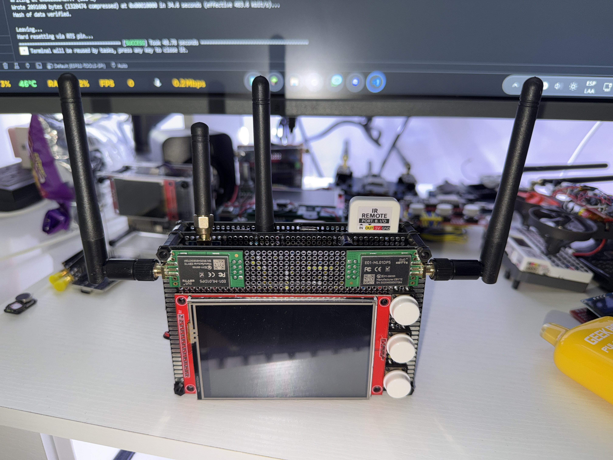 |
| Front view | 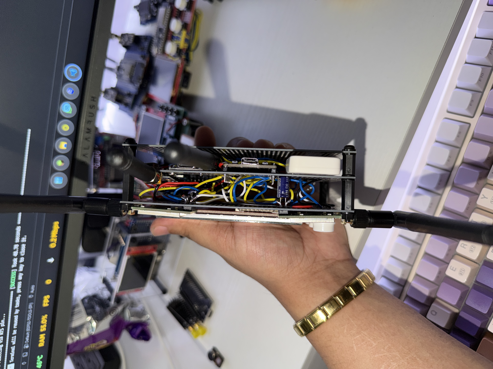 |
| Side view | 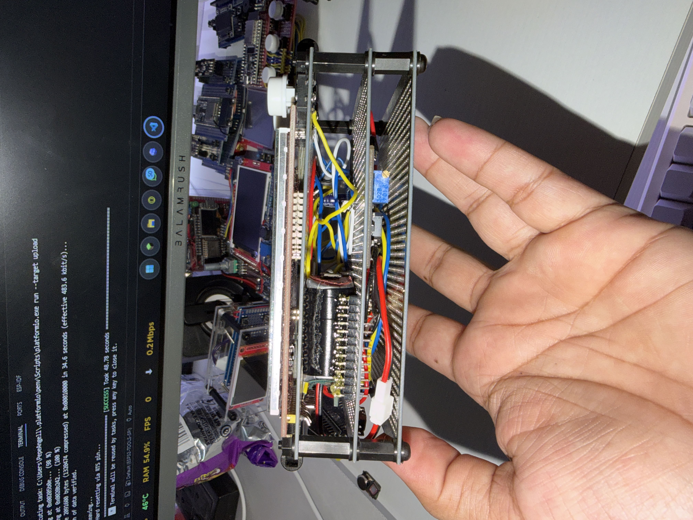 |
| Internal view / assembly | 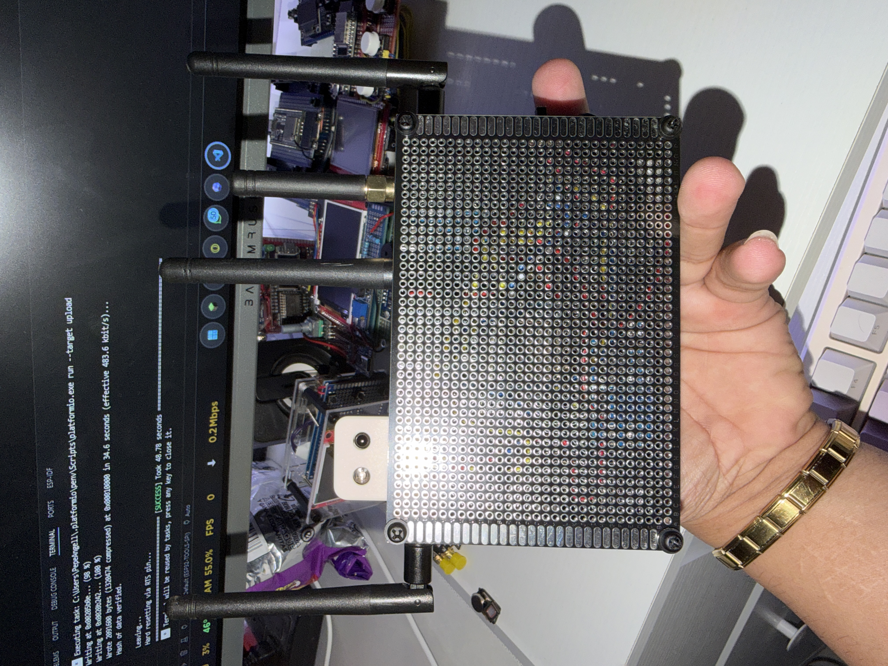 |

[Back to index](#index)

## Firmware screenshots

| Menu | Image |
| --- | --- |
| Splash |  |
| Main menu |  |
| WiFi Tools |  |
| WiFi scanner / channels |  |
| Radio Tools |  |
| Bluetooth Tools |  |
| Packet Monitor |  |
| System Tools |  |
| Screensaver |  |

[Back to index](#index)

## Navigation

- `UP`: move up or change value.
- `DOWN`: move down or change value.
- `OK`: enter, select, capture, or execute an action.
- `OK` held: go back, cancel, or exit the current screen.
- Submenus remember the option you were on when you return.

[Back to index](#index)

## Main functions

### WiFi Tools

- `WiFi Scanner`: scans nearby 2.4 GHz WiFi networks and shows SSID, BSSID, channel, RSSI, frequency, and security.
- `Channel Scan`: groups networks by channel, shows how many networks are on each channel, and lets you open the list of APs per channel.
- `WiFi Radar`: lets you pick an AP and track it by RSSI, proximity percentage, peak, trend, and history.
- `WiFi Direction Finder`: measures RSSI per sector to estimate the direction a network is coming from strongest.
- `WiFi Config`: connects the ESP32 to a network using a virtual keyboard and saves credentials in NVS.
- `Beacon Spam`: emits test beacons for a controlled lab.
- `Deauther`: WiFi testing tool for authorized environments.
- `Evil Portal`: educational captive portal to demonstrate phishing flows in your own lab.
- `Probe Sniffer`: observes nearby WiFi probes and shows detected activity.
- `KARMA Attack`: educational mode to understand responses to probes and insecure associations.

Important limitation: the classic ESP32 only works on 2.4 GHz WiFi. It cannot scan 5 GHz networks.

### Radio Tools

- `Jammer`: revamped mode for 2.4 GHz testing in your own lab. Lets you choose a WiFi channel, start/stop with `OK`, and uses both nRF24L01s when available.
- `Radio Scanner`: visual 2.4 GHz analyzer with spectrum, per-channel activity, and waterfall-type views.
- `Signal Tools`: IR tools and basic pin diagnostics.
- `CC1101`: dedicated sub-GHz menu with diagnostics, spectrum, monitor, finder, and RF analysis.

### Signal Tools / IR

- `Hardware Diag`: shows pins, SPI status, RX levels, and general hardware status.
- `Input Monitor`: shows activity on IR RX and the CC1101's GDO0 to validate wiring.
- `IR Raw Capture`: captures raw signals from infrared remotes.
- `IR Replay`: replays the last capture using a 38 kHz IR carrier.
- `IR TX Test`: emits three IR flashes to validate the transmitter with a phone camera.
- `Saved Captures`: saves IR captures with a name, loads, replays, renames, or deletes them.
- `IR Remotes`: creates virtual controls with buttons that point to saved captures.
- `IR Analyzer`: live IR activity detector with `IDLE`, `FRAME`, `REPEAT`, and `NOISE` states.
- `Protocol Scan`: tries to classify the signal as NEC, Samsung, LG, Sony, Panasonic, RC5, RC6, or RAW.
- `IR Sniffer`: logs live IR events with protocol, code, bits, duration, and repetitions.
- `Night IR`: detects pulsed/modulated IR activity from remotes, IR LEDs, sensors, or cameras with pulsed IR.
- `IR Proximity`: experimental IR bounce test. It does not measure real distance; it depends heavily on the physical setup.

IR notes:

- Many minisplits/air conditioners use long codes with the complete state. Raising temperature, lowering temperature, turning on, and turning off can be completely different captures.
- The demodulated IR receiver does not measure real analog intensity or the exact carrier frequency. The bars represent detected activity, not precise optical power.
- For reliable captures, point the remote directly at the receiver and avoid strong IR light around it.

### CC1101 Tools

- `Hardware Diag`: verifies SPI communication, `PARTNUM`, `VERSION`, `MARCSTATE`, RSSI, LQI, and the GDO0 level.
- `Spectrum Scan`: sweeps the common 315, 433, 868, and 915 MHz bands to see RSSI peaks.
- `Waterfall`: historical view of RF activity by frequency.
- `Frequency Mon`: monitors a fixed frequency such as 315.00, 390.00, 433.92, 868.35, or 915.00 MHz.
- `Freq Finder`: calibrates noise and automatically searches for the peak of a sub-GHz signal.
- `Brute Search`: broad search to find candidate activity.
- `Code Check`: compares several button presses to see whether a signal seems fixed or changing.
- `RF Analyzer`: shows pulses, total duration, short/long averages, OOK/ASK type, and signature/hash.
- `RF Raw View`: captures and draws the signal as bars/pulses to compare buttons.
- `RF Live`: live detector with frequency, peak RSSI, event counter, and last activity.
- `Lab Replay`: RF OOK/ASK replay only for your own fixed-code devices and lab testing.
- `Test Beacon`: short test transmission to validate RF output in a controlled environment.

CC1101 notes:

- `433.92 MHz` and `434 MHz` normally refer to the same practical zone. Many remotes are advertised as 434 even though they work near 433.92 MHz.
- The frequency meter is approximate. It does not replace a professional spectrum analyzer.
- Do not use RF replay on cars, gates, alarms, locks, or others' systems. Many use rolling code and should not be copied or tested outside your own lab.

### Bluetooth Tools

- `BLE Device Radar`: scans BLE, shows name, MAC, RSSI, manufacturer/type, and lets you track a target with history.
- `BLE Inspector`: improved scanner with classification by manufacturer, appearance, device type, and services.
- `iPhone Remote`: experimental BLE HID mode for basic pairing/control on your own devices.
- `BLE Spam`: educational BLE testing in the lab.
- `BT Disruptor`: controlled-lab Bluetooth testing.
- `BT Jammer`: 2.4 GHz sweep with dual nRF24L01 for educational short-range testing in your own environment.

### System Tools

- `Settings`: device configuration and saved options.
- `System Info`: memory, firmware, and ESP32 status information.
- `Clock & Weather`: clock/weather with a virtual keyboard for configuration.
- `Web Dashboard`: creates the `ESP32-TOOLS-PRO` AP with password `admin1234` and opens a web panel at `http://192.168.4.1`.
- `About`: project information.

### Web Dashboard

Phase 1 of the web dashboard is activated from `System > Web Dashboard`. On entering, the ESP32 brings up its own AP:

```text
SSID: ESP32-TOOLS-PRO
PASS: admin1234
URL : http://192.168.4.1
```

Functions available in phase 1:

- General dashboard with uptime, free heap, connected clients, and main pins.
- Quick diagnostics of IR RX and CC1101 GDO0 levels.
- List of saved IR captures with replay, rename, and delete.
- CC1101 monitor by frequency preset: 315.00, 390.00, 433.92, 868.35, and 915.00 MHz.
- WiFi Tools from the browser:
  - `WiFi Scanner`: list of networks, channel, RSSI, security, and BSSID.
  - `Channel Scan`: per-channel summary and a table of 2.4 GHz networks.
  - `WiFi Radar`: select an AP and track it by RSSI/proximity.
  - `Direction Finder`: measures front, right, back, and left to suggest the strongest direction.
  - `Beacon Spam`: controlled web demo with lab SSIDs, fixed dashboard channel, start/stop button, and auto-stop.
  - `Deauther`, `Evil Portal`, `Probe Sniffer`, and `KARMA Attack` appear as `LOCAL ONLY` to be used from the device screen.
- Bluetooth / Radio from the browser:
  - `BT Jammer`: can be started and stopped directly from the web dashboard, without physical confirmation on the device. Use it only in your own lab and at short range.

The dashboard keeps as `LOCAL ONLY` the functions that take full control of the WiFi, such as Deauther, Evil Portal, and KARMA, to avoid conflicts with the dashboard's AP. `BT Jammer` is the current exception: it can run from the web panel because it uses the nRF24L01s and does not need physical confirmation.

[Back to index](#index)

## Components used

| Component | Description | Recommended voltage | Notes |
| --- | --- | --- | --- |
| ESP32 Dev Module | Main microcontroller of the project | USB/5V on board | 3.3V GPIO logic |
| TFT 480x320 ILI9488 SPI | Main display | Depends on module, commonly 5V or 3.3V | SPI signals at 3.3V |
| nRF24L01 #1 | Main 2.4 GHz radio | 3.3V | Do not power at 5V |
| nRF24L01 #2 | Secondary 2.4 GHz radio | 3.3V | Capacitor near VCC/GND recommended |
| M5Stack IR Unit | IR receiver + transmitter | 5V | Wiring verified with OUT on GPIO26 and IN on GPIO34 |
| CC1101 | Sub-GHz radio for 315/433/868/915 MHz | 3.3V | Do not power at 5V |
| UP/OK/DOWN buttons | Firmware navigation | GPIO to GND | Uses internal `INPUT_PULLUP` |

### Component images

| Component | Image |
| --- | --- |
| ESP32 Dev Module |  |
| ILI9488 480x320 display | 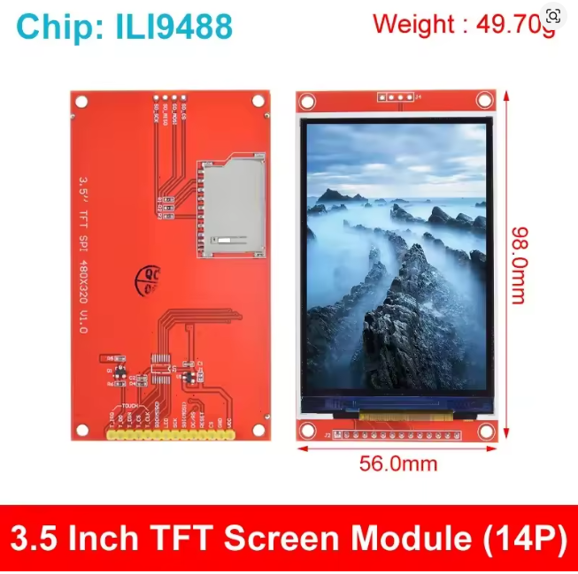 |
| nRF24L01 modules | 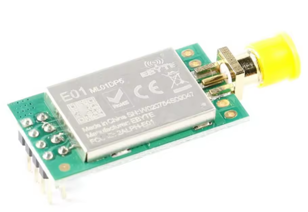 |
| nRF24L01 |  |
| CC1101 | 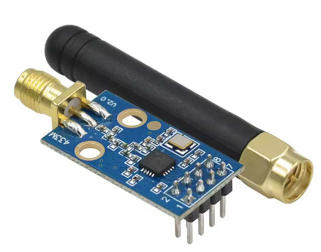 |
| Antenna | 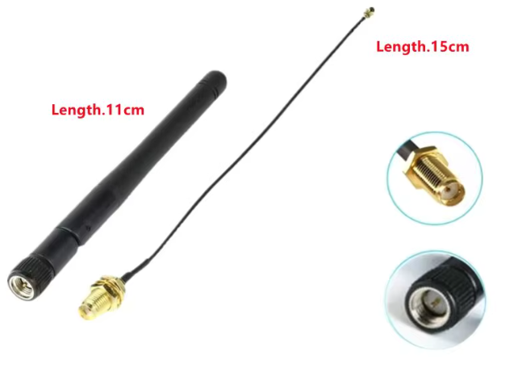 |
| M5Stack IR Unit | 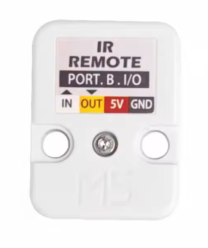 |
| IR Unit view 2 | 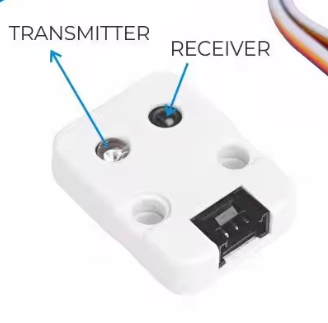 |
| Buttons | 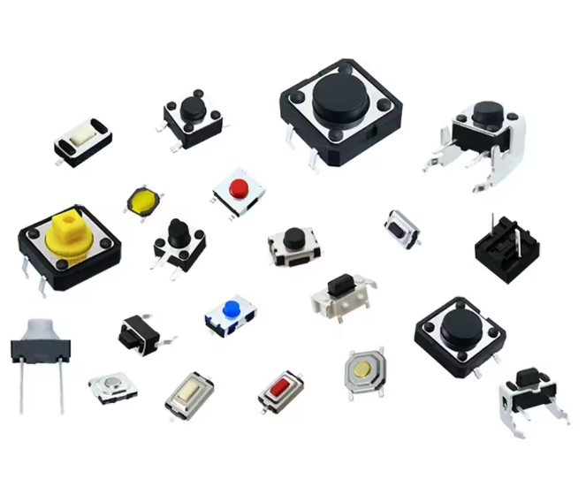 |
| Battery | 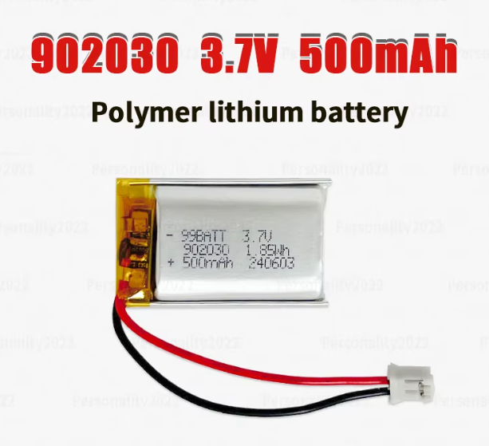 |
| TP4056 | 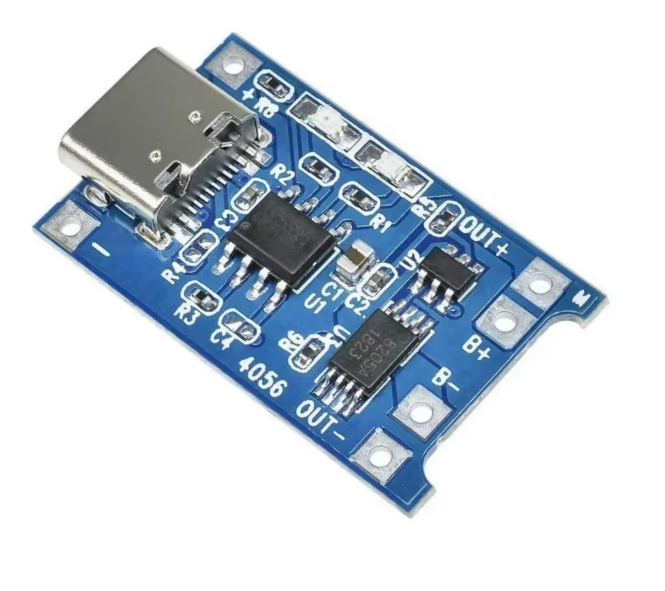 |
| Step-up | 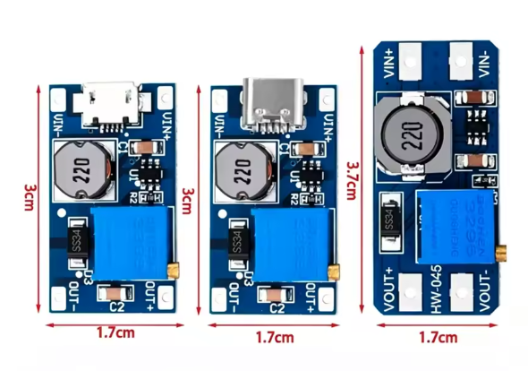 |
| Switch | 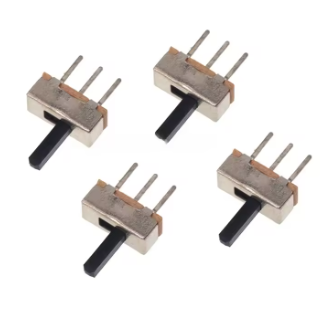 |
| PCB board / assembly | 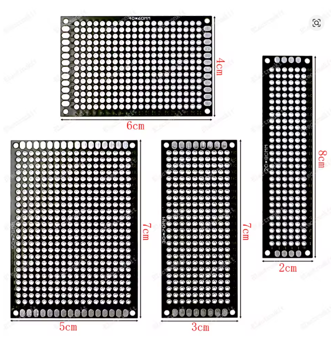 |

### Complete wiring diagrams

These diagrams show the wiring by blocks so it's easier to solder and review the assembly without overcrowding a single image.

#### TFT display and buttons


#### nRF24L01 modules


#### CC1101 and IR Remote


### Reference pinouts

| Module | Pinout |
| --- | --- |
| nRF24L01 PA + LNA |  |
| CC1101 |  |

[Back to index](#index)

## Connection table

All modules must share `GND` with the ESP32. Do not connect any 3.3V module to 5V.

### Shared SPI bus

| Signal | ESP32 GPIO | Used by |
| --- | ---: | --- |
| SCK | GPIO18 | TFT, nRF24 #1, nRF24 #2, CC1101 |
| MOSI | GPIO23 | TFT, nRF24 #1, nRF24 #2, CC1101 |
| MISO | GPIO19 | nRF24 #1, nRF24 #2, CC1101 |

Each SPI module has its own `CS/CSN` pin, which is why they can share SCK/MOSI/MISO.

### TFT 480x320 display

| TFT pin | ESP32 GPIO | Note |
| --- | ---: | --- |
| CS | GPIO5 | TFT chip select |
| RST | GPIO4 | TFT reset |
| DC / RS | GPIO22 | Data/Command |
| LED / BL | GPIO13 | Backlight |
| SCK / CLK | GPIO18 | Shared SPI |
| MOSI / SDI | GPIO23 | Shared SPI |
| MISO / SDO | Not used by TFT | The firmware defines TFT MISO as `-1` |
| VCC | Depends on module | Check your display: some accept 5V, others 3.3V |
| GND | GND | Common ground |

### nRF24L01 #1

| nRF24 pin | ESP32 GPIO | Note |
| --- | ---: | --- |
| CE | GPIO27 | Radio #1 control |
| CSN | GPIO14 | Radio #1 chip select |
| SCK | GPIO18 | Shared SPI |
| MOSI | GPIO23 | Shared SPI |
| MISO | GPIO19 | Shared SPI |
| VCC | 3.3V | Do not use 5V |
| GND | GND | Common ground |

### nRF24L01 #2

| nRF24 pin | ESP32 GPIO | Note |
| --- | ---: | --- |
| CE | GPIO17 | Radio #2 control |
| CSN | GPIO16 | Radio #2 chip select |
| SCK | GPIO18 | Shared SPI |
| MOSI | GPIO23 | Shared SPI |
| MISO | GPIO19 | Shared SPI |
| VCC | 3.3V | Do not use 5V |
| GND | GND | Common ground |

### M5Stack IR Unit

| IR module pin | ESP32 GPIO | Firmware function | Note |
| --- | ---: | --- | --- |
| OUT | GPIO26 | `IR_TX_PIN` | ESP32 output to the module's IR transmitter |
| IN | GPIO34 | `IR_RX_PIN` | ESP32 input from the module's IR receiver |
| 5V | 5V | Power | The M5Stack IR module works at 5V |
| GND | GND | Common ground | Sharing ground is mandatory |

GPIO34 is input-only, which is why it's used to receive IR. GPIO26 is used to transmit.

### CC1101

| CC1101 pin | ESP32 GPIO | Firmware function | Note |
| --- | ---: | --- | --- |
| CSN / CS | GPIO21 | `CC1101_CSN_PIN` | CC1101 chip select |
| SCK | GPIO18 | Shared SPI | SPI clock |
| MOSI / SI | GPIO23 | Shared SPI | Data from ESP32 to CC1101 |
| MISO / SO | GPIO19 | Shared SPI | Data from CC1101 to ESP32 |
| GDO0 | GPIO35 | `CC1101_GDO0_PIN` | RX input/RF edges |
| GDO2 extra | GPIO15 | `CC1101_TX_DATA_PIN` | Optional jumper for `Lab Replay` |
| VCC | 3.3V | Power | Do not use 5V |
| GND | GND | Common ground | Sharing ground is mandatory |

The `GDO0 extra -> GPIO15` jumper is only needed for the `Lab Replay` tests. You can leave it out if you'll only use diagnostics, monitor, finder, analyzer, and raw view.

### Buttons

| Button | ESP32 GPIO | Wiring |
| --- | ---: | --- |
| UP | GPIO32 | Button between GPIO32 and GND |
| OK | GPIO33 | Button between GPIO33 and GND |
| DOWN | GPIO25 | Button between GPIO25 and GND |

The buttons use the internal pull-up. When pressed, the pin goes `LOW`.

[Back to index](#index)

## Visual wiring diagram

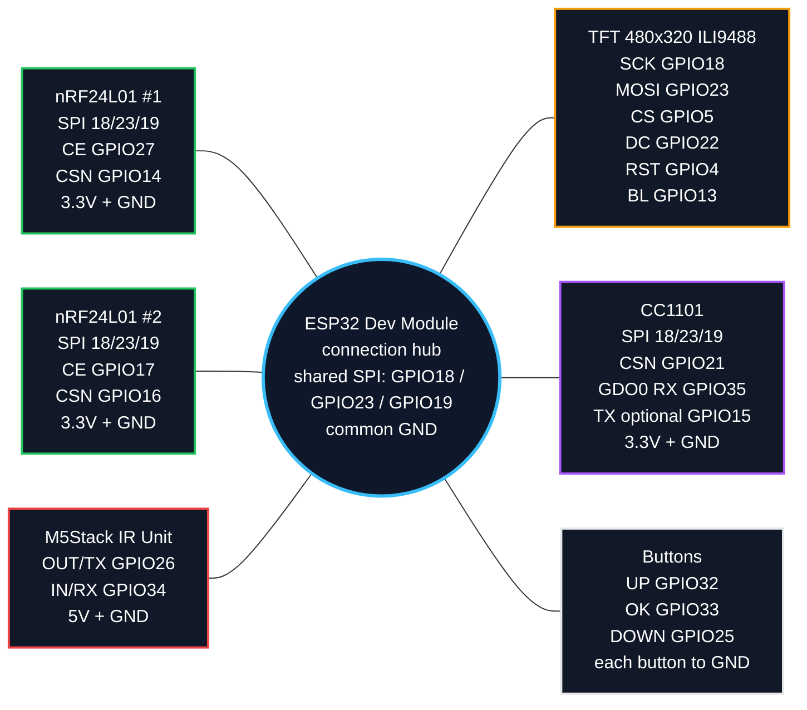

[Back to index](#index)

## Quick pin map

```text
ESP32 GPIO18  -> shared SPI SCK
ESP32 GPIO23  -> shared SPI MOSI
ESP32 GPIO19  -> shared SPI MISO

ESP32 GPIO5   -> TFT CS
ESP32 GPIO4   -> TFT RST
ESP32 GPIO22  -> TFT DC
ESP32 GPIO13  -> TFT Backlight

ESP32 GPIO27  -> nRF24 #1 CE
ESP32 GPIO14  -> nRF24 #1 CSN
ESP32 GPIO17  -> nRF24 #2 CE
ESP32 GPIO16  -> nRF24 #2 CSN

ESP32 GPIO26  -> IR OUT / TX
ESP32 GPIO34  -> IR IN / RX

ESP32 GPIO21  -> CC1101 CSN
ESP32 GPIO35  -> CC1101 GDO0 RX
ESP32 GPIO15  -> CC1101 GDO0 TX optional for Lab Replay

ESP32 GPIO32  -> UP button to GND
ESP32 GPIO33  -> OK button to GND
ESP32 GPIO25  -> DOWN button to GND
```

[Back to index](#index)

## Web flasher

Flash directly from the browser:

[https://pepeangell5.github.io/ESP32-TOOLS-PRO-480x320-V2.0/](https://pepeangell5.github.io/ESP32-TOOLS-PRO-480x320-V2.0/)

The page uses ESP Web Tools and these files from the repo:

- `index.html`: flashing page with ESP Web Tools.
- `manifest.json`: manifest used by ESP Web Tools.
- `assets/Firmware/firmware-merged.bin`: complete binary to flash from offset `0x0`.
- `assets/Firmware/firmware.bin`: compiled application.
- `assets/Firmware/bootloader.bin`: bootloader.
- `assets/Firmware/partitions.bin`: partition table.

Target repo:

```text
https://github.com/pepeangell5/ESP32-TOOLS-PRO-480x320-V2.0
```

[Back to index](#index)

## Compiling and uploading with PlatformIO

Compile:

```bash
pio run
```

Upload to the ESP32:

```bash
pio run -t upload --upload-port COM3
```

If the upload fails with a boot/serial error, hold down `BOOT` when the upload starts and release it when PlatformIO begins writing.

[Back to index](#index)

## Known limitations

- WiFi is 2.4 GHz only because the classic ESP32 has no 5 GHz radio.
- The CC1101 gives approximate RSSI/frequency readings; it is not a professional spectrum analyzer.
- `IR Proximity` is experimental and may stay at `NONE` depending on the angle and physical bounce.
- Air conditioners often use long signals with the complete state; save each function separately.
- `Jammer`, `BT Jammer`, `BLE Spam`, `BT Disruptor`, `Deauther`, `KARMA`, and `Beacon Spam` are lab functions. They can degrade nearby communications and should be used only with authorization.
- `Lab Replay` RF is intended for lights, plugs, or your own fixed-code devices. It is not for vehicles, alarms, locks, or gates.
- The RF433T/RF433R modules are left out of V2.0.

[Back to index](#index)

## Credits

Project created and tested by PepeAngell for ESP32-TOOLS-PRO-480x320-V2.0.

[Back to index](#index)

## Social media and links

- GitHub: [github.com/pepeangell5](https://github.com/pepeangell5)
- Web Flasher: [pepeangell5.github.io/ESP32-TOOLS-PRO-480x320-V2.0](https://pepeangell5.github.io/ESP32-TOOLS-PRO-480x320-V2.0/)
- Instagram: [@pepeangelll](https://instagram.com/pepeangelll)
- Facebook: [ESP32Tools](https://www.facebook.com/esp32tools/)

[Back to index](#index)

[Back to top](#esp32-tools-pro-480x320-v20)
